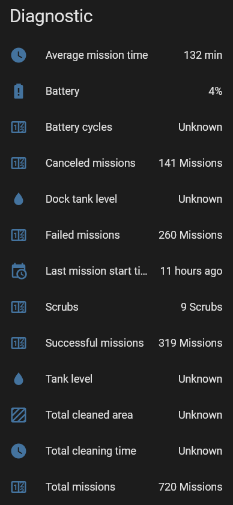

# ha-quirks
Documentation and code snippets for workarounds for Home Assistant integrations.

# Roomba
As of today 23.3.2026 the integration has a lot of missing diagnostic data with j7+ model.  

## Helpers
- timer.mission_timer
    - 3h0m0s
- input_number.mission_clean_time
    - 0 - 180
    - minutes

## [Find My Roomba](roomba/automations/find_my_roomba.yaml)
Send locate command when coming home if status is error or not cleaning or docked.

## [Mission Cleaning Time](roomba/automations/mission_cleaning_time.yaml)
Not available via the integration. Calculated with `timer.mission_timer` and `input_number.mission_clean_time`. Note that the time is only updated on pause/finished/error.